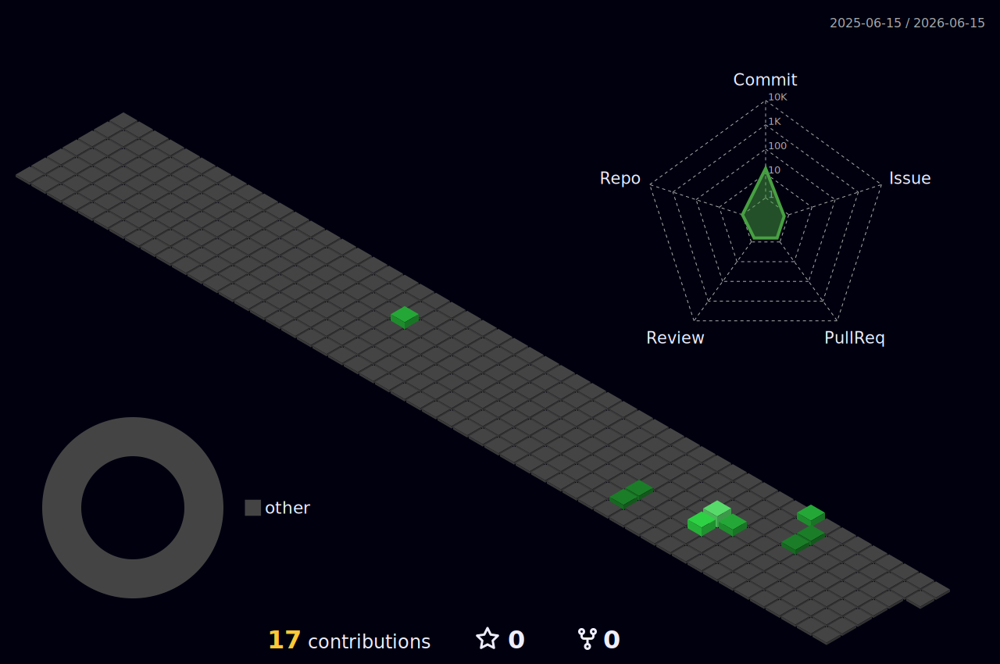

<h3 align="center">
  
 你好,我是树脂蛋白2333👋 

  
 DE BD6KIZ 73 

  
 -.. . -... -.. -.... -.- .. --.. --... ...-- 

</h3>

### 关于我自己

* 来自 🇨🇳
* 🏫一名准大学生
* 💻一个半吊子软件开发者
* 🔍开源爱好者
* 🔐网络安全技术爱好者
* 📻业余无线电爱好者

### 我可以使用这几种编程语言进行开发

### 我会使用这些技术

### 我的邮箱地址

#### 我的个人博客站

### 近一月的代码仓库提交状况:

### 近一月的代码仓库提交3D视图:

